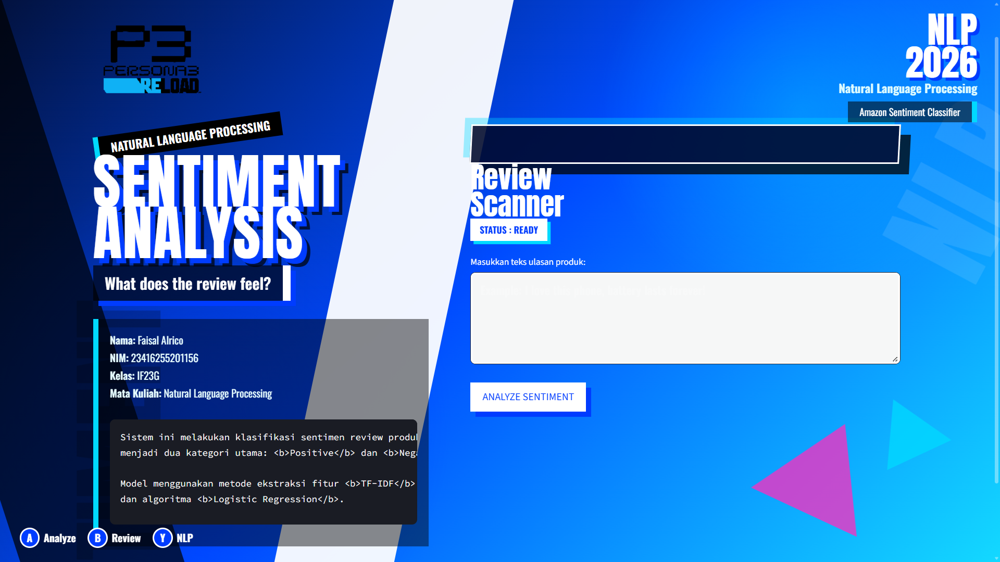

# Amazon Sentiment Analysis NLP - P3R Theme

Prototype Sentiment Analysis Application using:

- Natural Language Processing (NLP)
- TF-IDF Vectorizer
- Logistic Regression
- Amazon Review Dataset

The interface is inspired by Persona 3 Reload UI design.

---

## Preview



---

## Features

- Sentiment Classification
- Positive / Negative Prediction
- Streamlit Interface
- Persona 3 Reload Inspired UI
- Real-time Prediction

---

## Technologies

- Python
- Streamlit
- Scikit-Learn
- Pandas
- TF-IDF
- Logistic Regression

---

## Dataset

Amazon Cell Phones Review Dataset

---

## Run Locally

```bash
pip install -r requirements.txt
streamlit run app.py
```

---

## Example Result

Input:
> I love this phone, the battery lasts very long.

Prediction:
> POSITIVE

---

## Author

Faisal Alrico  
IF23G - Natural Language Processing
